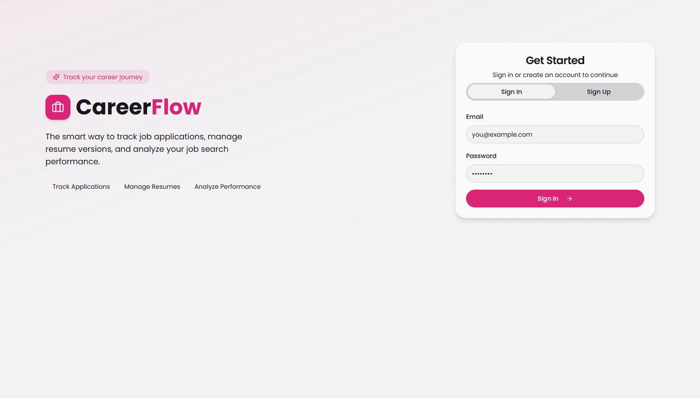
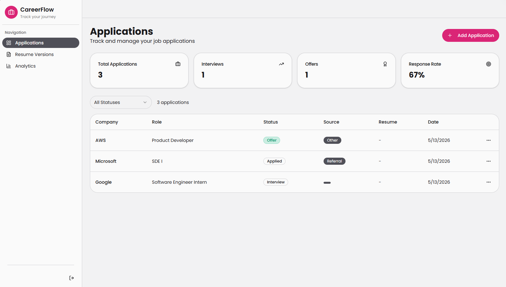
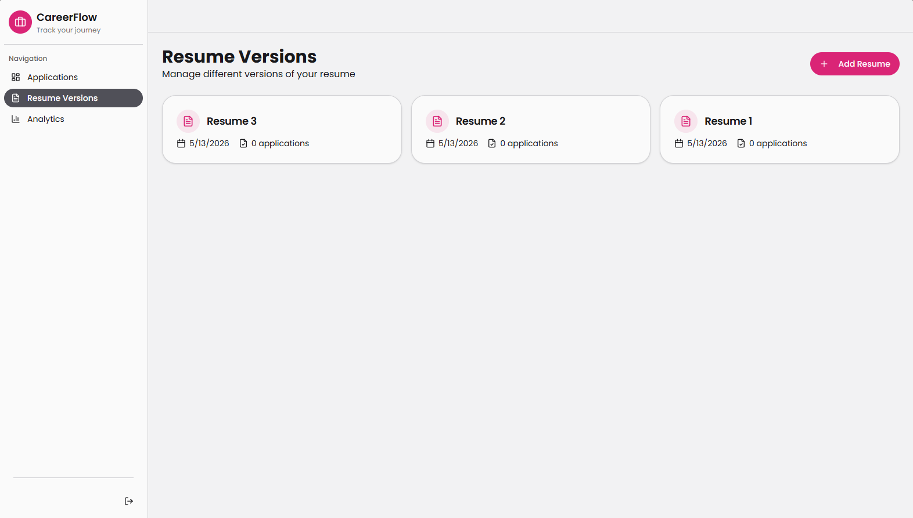
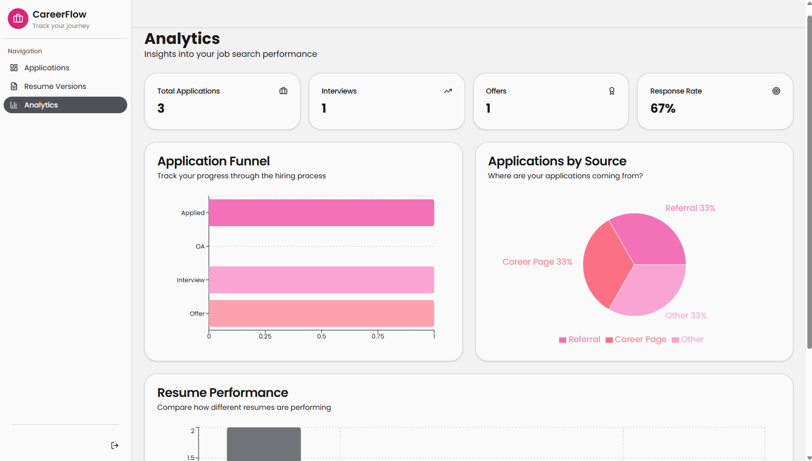

# CareerFlow

CareerFlow is a full-stack web application designed to help users manage and track job and internship applications efficiently. It provides a centralized platform to monitor application progress, manage resume versions, and analyze performance.

---

## Features

- Track job and internship applications
- Update application status (Applied, OA, Interview, Offer, Rejected)
- Manage multiple resume versions
- View analytics such as response rate and application funnel
- Automated follow-up reminders using background jobs
- Secure user authentication using JWT

---

## Tech Stack

### Frontend
- React (TypeScript)
- Tailwind CSS
- Recharts
- Axios

### Backend
- Node.js
- Express.js

### Database
- MongoDB Atlas

### Other
- JWT Authentication
- Node-cron (for scheduled reminders)

---
# Application Preview

## Login / Signup



---

## Dashboard



---

## Resume Management



---

## Analytics



---

# System Architecture


---

## API Endpoints

### Auth
- POST /auth/register
- POST /auth/login

### Applications
- GET /applications
- POST /applications
- PATCH /applications/:id/status
- DELETE /applications/:id

### Resumes
- GET /resumes
- POST /resumes
- DELETE /resumes/:id

### Analytics
- GET /analytics/funnel
- GET /analytics/source-performance
- GET /analytics/resume-performance

### Reminders
- GET /reminders
- PATCH /reminders/:id/done

---

## Installation

### 1. Clone the repository
```

git clone https://github.com/Keerthi-A-Gorey/CareerFlow.git
cd careerflow

```

### 2. Install dependencies

### 3. Setup environment variables

Create a `.env` file in the server directory:

```

MONGO_URI=your_mongodb_connection_string
JWT_SECRET=your_secret_key
PORT=5000

```

### 4. Run the application

Start backend:
```

cd careerflow-backend/src
npm run dev

```

Start frontend:
```

cd careerflow-dashboard-main/src
npm start

````

---

## Usage

1. Register or log in to your account
2. Add job or internship applications
3. Update application status as you progress
4. Manage resume versions
5. View analytics to track performance
6. Check reminders for follow-ups

---

## Future Improvements

- Email and push notifications
- Integration with job platforms
- Mobile application support
- Advanced analytics and recommendations

---

## License

This project is for academic and personal use.
